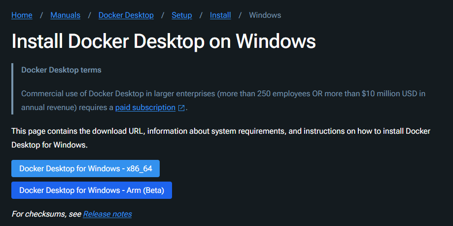

# Ejercicio 4 - Docker Compose

# 🛠 Guía: Desplegar Aplicación con Docker Compose - `htop`

## 🚀 Descripción del Proyecto

Este proyecto tiene como objetivo desplegar la aplicación **`htop`** utilizando **Docker Compose**. `htop` es una herramienta interactiva de monitoreo de procesos que permite visualizar en tiempo real el uso de los recursos del sistema, como el uso de la CPU, la memoria y los procesos activos.

---

## ✅ Pasos del Proceso

### 1. **Instalar Docker y Docker Compose**

Antes de comenzar, asegúrate de tener **Docker** y **Docker Compose** instalados en tu máquina. Puedes verificarlo con los siguientes comandos:

```bash

docker --version
docker-compose --version

```

Si no los tienes instalados, consulta las guías de instalación en los siguientes enlaces:

- Instalar Docker
- Instalar Docker Compose




---

### 2. **Crear el Archivo `docker-compose.yaml`**

### 2.1. **Acceder al directorio de trabajo**

Primero, crea un directorio para tu proyecto y accede a él:

```bash

mkdir htop-docker
cd htop-docker

```

### 2.2. **Crear el archivo `docker-compose.yaml`**

Crea un archivo llamado `docker-compose.yaml` en el directorio recién creado con el siguiente contenido:

```yaml

version: '3'
services:
  htop:
    image: jrottenberg/htop:latest
    container_name: htop
    tty: true
    stdin_open: true
    command: ["htop"]
    ports:
      - "8080:8080" 

```


---

### 3. **Iniciar los Contenedores con Docker Compose**

### 3.1. **Levantar el Contenedor**

Ejecuta el siguiente comando para iniciar el contenedor en segundo plano:

```bash

docker-compose up -d

```


Tuve que abrir el .yml y cambiar el codigo por este:

```bash
services:
  htop:
    image: ubuntu:latest
    container_name: htop
    tty: true
    stdin_open: true
    command: ["bash", "-c", "apt-get update && apt-get install -y htop && htop"]
    ports:
      - "8080:8080"  

```

Me daba un error con el anterior codigo:


### 3.2. **Verificar el Estado del Contenedor**

Verifica que el contenedor esté corriendo con el siguiente comando:

```bash

docker ps
```


---

### 4. **Acceder a la Aplicación `htop`**

### 4.1. **Conectarse al Contenedor**

Para ejecutar `htop` dentro del contenedor, primero conéctate a él usando:

```bash

docker exec -it htop bash

```

### 4.2. **Ejecutar `htop`**

Dentro del contenedor, ejecuta el siguiente comando:

```bash

htop

```


---

### 6. **Explicación de la Herramienta `htop`**

### ¿Qué es `htop`?

`htop` es una herramienta interactiva que muestra información en tiempo real sobre los procesos del sistema, el uso de la CPU, memoria, discos, redes y otros recursos. Es una versión mejorada del comando `top`, con una interfaz gráfica de usuario más amigable.

### Características de `htop`:

- **Interactividad**: Permite navegar fácilmente entre los procesos con las teclas de dirección.
- **Visualización**: Muestra gráficos en tiempo real de los recursos del sistema.
- **Gestión de Procesos**: Permite matar procesos o cambiar su prioridad de manera fácil.

---

###